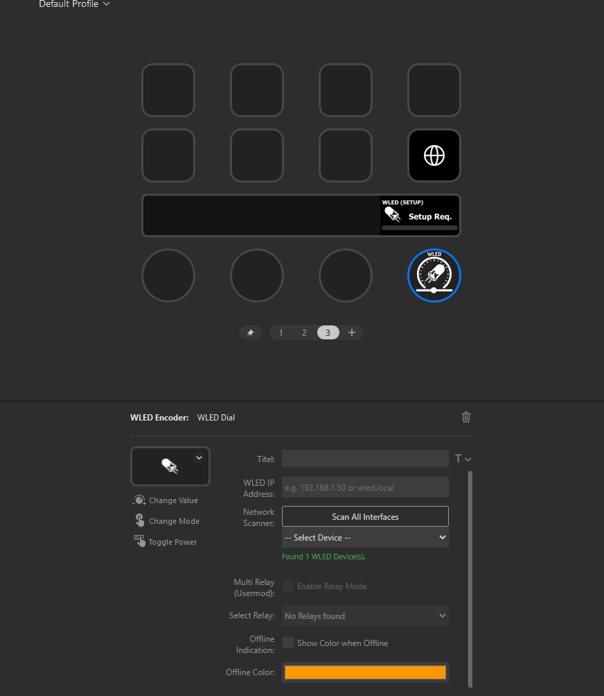

# WLED Controller for Stream Deck+

A powerful Stream Deck+ plugin to control [WLED](https://kno.wled.ge/) instances directly via the dials (encoders). This plugin offers two-way synchronization, live visual feedback on the dial stack, and support for the MultiRelay Usermod.

## Features

* **Multi-Mode Control:** Switch between **Brightness**, **Effects**, **Presets**, **Palettes**, and **Relays** directly from the dial.
* **Live Feedback:** The dial displays the current WLED state (Name, Mode, Value, and specific Brightness Bar) generated in real-time.
* **Smart Power Control:** Tap the touch strip to toggle power (Logic handles "Soft On" to restore previous brightness).
* **Turbo Network Scanner:** Automatically finds WLED devices on your network.
* **MultiRelay Support:** Native support for the WLED MultiRelay Usermod to switch physical relays.
* **Offline Indication:** Visual alert (customizable color) when the WLED device is unreachable.

## Prerequisites

* **Hardware:** Elgato Stream Deck+ (Encoder support required).
* **OS:** Windows 10 or 11.
* **Software:** Stream Deck App 6.5 or later.
* **Device:** An ESP8266/ESP32 running [WLED](https://github.com/Aircoookie/WLED) (Version 0.10.0 or newer recommended).

## Installation

1.  Download the latest `.streamDeckPlugin` release from GitHub.
2.  Double-click the file to install it into your Stream Deck software.
3.  Drag the **WLED Dial** action from the "WLED Controller" category to a dial stack on your Stream Deck+.

## Configuration

### 1. Connecting to WLED
You can connect to your WLED device in two ways via the Property Inspector:

* **Auto-Discovery (Recommended):**
    1.  Click the **"Scan All Interfaces"** button.
    2.  Wait for the scan to complete (status is shown below the dropdown).
    3.  Select your device from the **"Found Devices"** dropdown list.
* **Manual Entry:**
    * Simply type the IP address (e.g., `192.168.1.50`) or hostname (e.g., `wled.local`) into the "WLED IP Address" field.

### 2. MultiRelay Setup (Advanced)
This plugin supports the **MultiRelay Usermod**, which allows WLED to control physical electrical relays (e.g., for switching non-addressable lights or other appliances).

**How to implement MultiRelay in WLED:**
Since this is an optional feature, it is often not included in standard WLED binaries. You may need to compile WLED yourself to enable it.
1.  Read the official documentation: [WLED MultiRelay Usermod Docs](https://mm.kno.wled.ge/usermods/MultiRelay/).
2.  Compile and flash WLED with `-D USERMOD_MULTI_RELAY` enabled.
3.  Configure the GPIO pins for your relays in the WLED web interface ("Config" -> "Usermods").

**Configuring the Plugin:**
1.  Once MultiRelay is active on your device, the plugin will automatically detect it via the API.
2.  The **"Enable Relay Mode"** checkbox in the Stream Deck software will unlock.
3.  Check the box and select the specific **Target Relay** (0-3) you want to control with this specific dial.

### 3. Customization
* **Offline Color:** Choose a specific background color (default: Orange) to display on the dial if the connection to WLED is lost.

## Usage

Once configured, the dial operates as follows:

### 🖐️ Touch Strip (Tap)
* **Action:** Toggles Power On/Off.
* **Logic:** Uses "Soft Control". If the light is on but dimmed, it turns off. If turned on, it restores the last known brightness (or defaults to 50% if unknown).

### 🔘 Dial Push (Change Mode)
* **Action:** Press the dial to enter **"Selection Mode"** (Background turns blue).
* **Navigate:** Rotate the dial to cycle through available modes:
    * `BRIGHTNESS`
    * `EFFECT` (FX)
    * `PRESET`
    * `PALETTE`
    * `RELAY` (Only visible if enabled in settings)
* **Confirm:** Press the dial again to confirm the selection. The dial returns to normal control after 3 seconds of inactivity.

### 🔄 Dial Rotate (Control Value)
Depends on the selected mode:
* **Brightness:** Increases/Decreases brightness in 10% steps.
* **Effect:** Cycles through the list of effects installed on the WLED device.
* **Preset:** Cycles through your saved WLED presets (skips empty slots).
* **Palette:** Cycles through color palettes.
* **Relay:** Toggles the selected relay On/Off.

## Technical Details & Privacy

### How the Network Scanner works
To make setup as easy as possible, this plugin includes a "Turbo Network Scanner".
* **Scope:** When you click "Scan", the plugin iterates through **all active IPv4 network interfaces** (LAN, WiFi, Virtual Adapters) on your computer.
* **Privacy:** This happens entirely locally on your machine. No network data is sent to the cloud or third parties.
* **Performance:** The scanner prioritizes common home subnet ranges (e.g., `192.168.178.x`, `192.168.1.x`, `192.168.0.x`) to find devices quickly, but will eventually scan all detected local subnets to ensure devices on complex network setups (e.g., VLANs) are found.

## Troubleshooting

* **"NO CONN" / Offline Color:**
    * Check if the WLED device is powered on.
    * Verify the IP address in the Stream Deck software.
    * Ensure your PC and WLED are on the same network.
* **Relay Checkbox is disabled:**
    * The plugin queries the WLED JSON API. If the device does not report a `MultiRelay` object, the checkbox remains disabled to prevent errors. Ensure the Usermod is compiled and enabled in WLED.
* **Presets not loading:**
    * The plugin fetches `presets.json` upon connection. If you add new presets in WLED, switch profiles or restart the Stream Deck software to reload the list.

## ⚠️ DISCLAIMER

**USE AT YOUR OWN RISK.**

This software is provided "as is", without warranty of any kind, express or implied.

* **No Liability:** The author accepts **no liability** for any direct, indirect, incidental, or consequential damages resulting from the use or misuse of this plugin. This includes, but is not limited to, hardware damage (LED strips, power supplies, relays), data loss, or personal injury.
* **Photosensitivity Warning:** This plugin allows rapid changing of light effects (including strobes and flashing patterns). Some WLED effects may trigger seizures in people with **photosensitive epilepsy**. Please use with caution.
* **Electrical Safety:** Running LED strips at 100% brightness for extended periods can generate significant heat and load on your power supply. Ensure your wiring is safe and components are correctly rated.
* **Affiliation:** This project is an independent community plugin and is **not** affiliated with, endorsed by, or associated with Elgato, Corsair, or the WLED project.

## License

[MIT License](LICENSE)